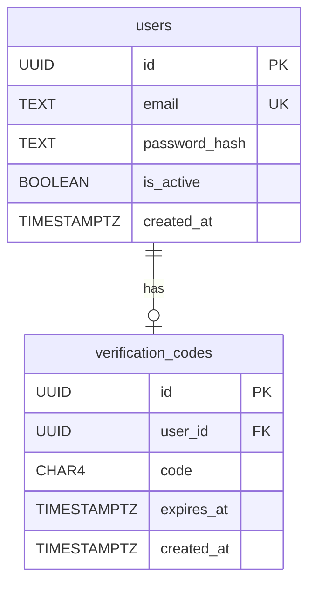
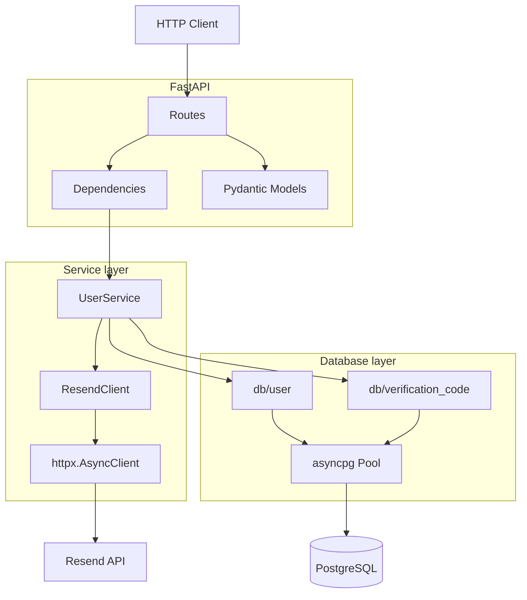
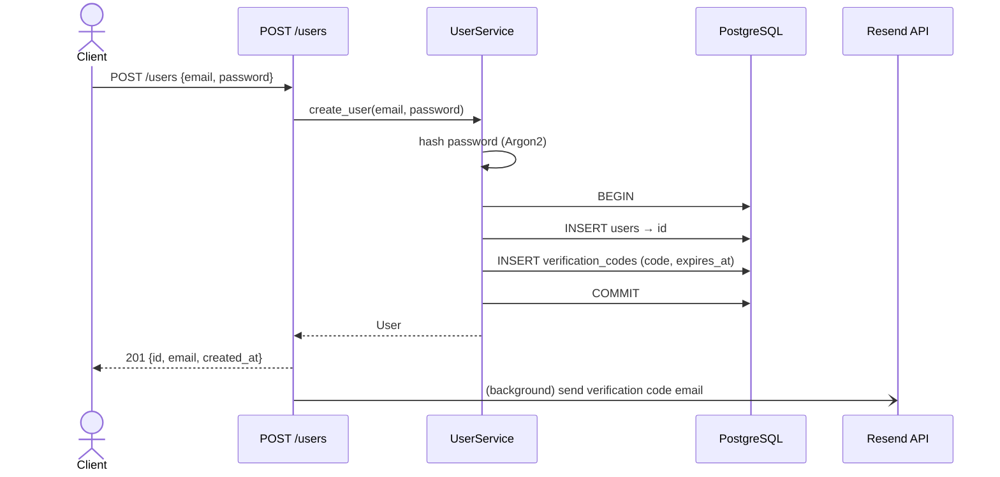
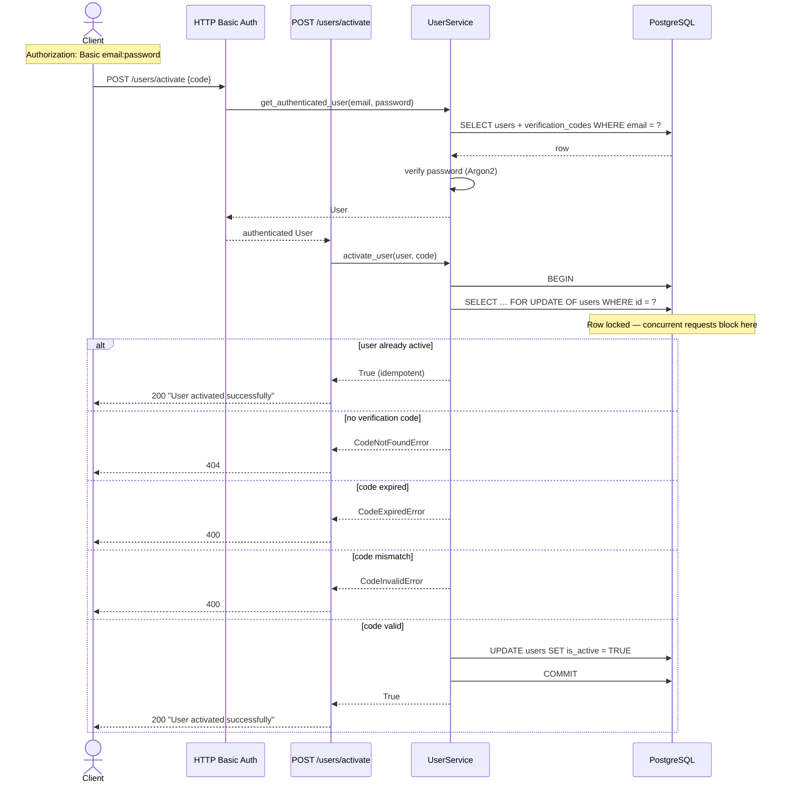

# User Registration API

A user registration and email verification API built with FastAPI and PostgreSQL.

## Running the application

```bash
docker compose up --build
```

This starts two containers:

- **api** — FastAPI application on http://localhost:8000
- **db** — PostgreSQL 16

The API is ready when `docker compose up` shows the uvicorn startup log. You can also check:

```bash
curl http://localhost:8000/status
```

## Running the tests

```bash
docker compose -f docker-compose.yml -f docker-compose.test.yml run --rm --build test
```

This spins up a dedicated in-memory PostgreSQL database, runs the full test suite, then removes the container. No application containers need to be running beforehand.

## Application Schema

### Database



> `verification_codes.user_id` is a `UNIQUE` index — one code per user at a time.

---

### Application layers



---

### Registration flow



---

### Activation flow


